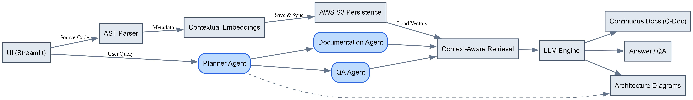

# 🤖 CodeBot

# 🤔 What is CodeBot?

**CodeBot** is an agentic AI assistant and service designed to let you talk directly to your codebase and fully automate the generation and maintenance of Context-Aware documentation.

---

# ⚠️ The Challenge

Navigating and understanding large, legacy, or unfamiliar codebases is a significant bottleneck.
- **Documentation Decay**: It is nearly impossible to keep documentation updated as the codebase rapidly evolves during active development.
- **Shallow AI Generation**: Existing documentation agents only document the raw Python code of a single file. They completely miss the dependencies, downstream impact, and the module's actual role in the broader system.
- **Naive Search Limits**: Standard vector search (RAG) often retrieves irrelevant chunks, failing to capture module-level relationships or execution flows.

---

# ✨ The CodeBot Solution & Novelty

CodeBot introduces an **AST-Powered, Context-Aware Architecture** that understands your code the way a senior engineer does.

* **AST-Powered Parsing**: We extract highly structured metadata, defining strict relationships.
* **Contextual Intelligence**: CodeBot goes beyond simple search by heavily relying on these strict graph relationships, enabling it to map exactly how components interact.
* **Continuous Documentation (C-Doc)**: Automatically keeps your codebase documentation perfectly synchronized and updated in your repository as development occurs. 

---

# 🚀 Key Features

* **LangGraph-Based Agents**: Orchestrates robust multi-agent workflows (Planner, QA, Documentation Agents) to tackle complex codebase tasks.
* **Config-Based Agent Creation**: Easily define, manage, and expand agents, prompts, and toolsets centrally.
* **Context-Aware Docs**: Leverages exact dependency mappings to automatically cite downstream usage and provide real, connected examples.
* **Intelligent Diagramming**: Generates real-time, interactive Graphviz Architecture Diagrams (System, Module, and Symbol scope).
* **Automated Setup & Persistent Storage**: Effortlessly ingest ZIPs or clone from GitHub, backed seamlessly by AWS S3.
* **Flexible LLM Backend**: Toggle between OpenAI, Anthropic, AWS Bedrock, or local Ollama LLMs directly from the UI.

---

# 🏗️ System Architecture

---

# 🔮 Future Improvements

While CodeBot currently excels with Python codebases, the architecture is designed for extensibility:

* **Multi-Language Support**: Expanding the AST parser to support languages like Java, Go, C++, and JavaScript/TypeScript.
* **Symbol-Level Architecture Graphs**: Drilling down beyond module-level interaction to map deep execution paths between specific classes, functions, and methods.
* **IDE Plugin Integration**: Bringing the intelligence of CodeBot directly into VS Code or JetBrains IDEs.

---

# 💻 Live Demo Time!

Let's dive into the UI and see CodeBot in action.
